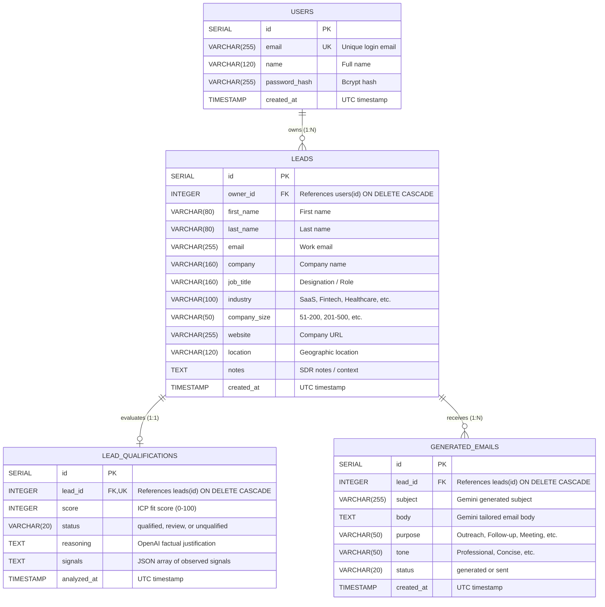

# LeadPilot - Database Design & Scripts Documentation

This document provides a comprehensive overview of the **PostgreSQL relational database schema**, entity relationships, performance indexes, and execution instructions for the **LeadPilot Mini AI SDR** platform.

This document directly satisfies the **"Database Scripts"** mandatory deliverable required by the **AI SDR Intern Technical Assessment**.

---

## 🗄️ Database Architecture Overview

- **Database Engine**: PostgreSQL 16+
- **Driver / ORM**: SQLAlchemy 2.0 with `psycopg3` (`postgresql+psycopg`)
- **Default Database Name**: `leadpilot`
- **Default User Role**: `leadpilot` / `leadpilot`
- **Isolation Model**: Multi-tenant / user-scoped boundaries where every prospect lead, qualification score, and generated outreach draft is strictly owned and isolated by `owner_id`.

---

## 📊 Entity Relationship Diagram (ERD)



---

## 📑 Relational Tables Specification

### 1. `users` Table
Stores authenticated sales development representatives and account credentials.

| Column | Type | Constraints | Description |
| :--- | :--- | :--- | :--- |
| `id` | `SERIAL` | `PRIMARY KEY` | Unique internal user ID |
| `email` | `VARCHAR(255)` | `UNIQUE, NOT NULL` | Login email address (indexed) |
| `name` | `VARCHAR(120)` | `NOT NULL` | Full display name |
| `password_hash` | `VARCHAR(255)` | `NOT NULL` | Bcrypt hashed password |
| `created_at` | `TIMESTAMP` | `DEFAULT UTC, NOT NULL` | Account registration date |

---

### 2. `leads` Table
Stores prospect contacts managed by sales representatives.

| Column | Type | Constraints | Description |
| :--- | :--- | :--- | :--- |
| `id` | `SERIAL` | `PRIMARY KEY` | Unique lead record ID |
| `owner_id` | `INTEGER` | `NOT NULL, FK -> users(id)` | Cascading foreign key to owner user |
| `first_name` | `VARCHAR(80)` | `NOT NULL` | Prospect first name |
| `last_name` | `VARCHAR(80)` | `NOT NULL` | Prospect last name |
| `email` | `VARCHAR(255)` | `NOT NULL` | Prospect contact email |
| `company` | `VARCHAR(160)` | `NOT NULL` | Prospect company organization |
| `job_title` | `VARCHAR(160)` | `NULLABLE` | Professional designation |
| `industry` | `VARCHAR(100)` | `NULLABLE` | Industry segment (SaaS, Fintech, etc.) |
| `company_size` | `VARCHAR(50)` | `NULLABLE` | Employee size bracket |
| `website` | `VARCHAR(255)` | `NULLABLE` | Company web address |
| `location` | `VARCHAR(120)` | `NULLABLE` | City / Country |
| `notes` | `TEXT` | `NULLABLE` | SDR contextual notes |
| `created_at` | `TIMESTAMP` | `DEFAULT UTC, NOT NULL` | Lead ingestion timestamp |

**Compound Constraint:**
- `CONSTRAINT uq_owner_lead_email UNIQUE (owner_id, email)`: Ensures each SDR user cannot ingest duplicate prospect emails while allowing different SDRs to manage their own contacts independently.

---

### 3. `lead_qualifications` Table (Objective 4: OpenAI Integration)
Stores structured qualification analysis generated by the **OpenAI API (`gpt-4o-mini`)**.

| Column | Type | Constraints | Description |
| :--- | :--- | :--- | :--- |
| `id` | `SERIAL` | `PRIMARY KEY` | Unique qualification record ID |
| `lead_id` | `INTEGER` | `NOT NULL, UNIQUE, FK -> leads(id)` | 1-to-1 cascading relationship to lead |
| `score` | `INTEGER` | `CHECK (score >= 0 AND score <= 100)` | Numerical ICP fit score |
| `status` | `VARCHAR(20)` | `CHECK IN ('qualified', 'review', 'unqualified')` | Categorical decision |
| `reasoning` | `TEXT` | `NOT NULL` | Concise reasoning generated by OpenAI |
| `signals` | `TEXT` | `DEFAULT '[]', NOT NULL` | JSON array of observed signals |
| `analyzed_at` | `TIMESTAMP` | `DEFAULT UTC, NOT NULL` | Qualification analysis timestamp |

---

### 4. `generated_emails` Table (Objective 5: Gemini Integration)
Stores bespoke sales outreach drafts generated by the **Google Gemini API (`gemini-3.6-flash`)**.

| Column | Type | Constraints | Description |
| :--- | :--- | :--- | :--- |
| `id` | `SERIAL` | `PRIMARY KEY` | Unique email draft ID |
| `lead_id` | `INTEGER` | `NOT NULL, FK -> leads(id)` | 1-to-N cascading relationship to lead |
| `subject` | `VARCHAR(255)` | `NOT NULL` | Generated email subject line |
| `body` | `TEXT` | `NOT NULL` | Generated email body text |
| `purpose` | `VARCHAR(50)` | `NOT NULL` | Outreach purpose (Intro, Follow-up, etc.) |
| `tone` | `VARCHAR(50)` | `NOT NULL` | Communication tone (Professional, etc.) |
| `status` | `VARCHAR(20)` | `DEFAULT 'generated', NOT NULL` | Status (`generated`, `sent`) |
| `created_at` | `TIMESTAMP` | `DEFAULT UTC, NOT NULL` | Generation timestamp |

---

## ⚡ Performance Optimization & Indexes

To ensure fast query execution across large sales pipelines, the schema includes the following B-Tree indexes:

1. `idx_users_email` ON `users(email)`: Rapid authentication lookup during login.
2. `idx_leads_owner_id` ON `leads(owner_id)`: Instant filtering by current authenticated user.
3. `idx_leads_email` ON `leads(email)`: Fast deduplication checks.
4. `idx_leads_created_at` ON `leads(created_at)`: Efficient pagination and chronological sorting.
5. `idx_qualifications_lead_id` ON `lead_qualifications(lead_id)`: Quick join of qualification records.
6. `idx_qualifications_status` ON `lead_qualifications(status)`: Instant pipeline status aggregation.
7. `idx_emails_lead_id` ON `generated_emails(lead_id)`: Fast retrieval of email history per lead.
8. `idx_emails_created_at` ON `generated_emails(created_at)`: Chronological email log ordering.

---

## 📜 Full PostgreSQL DDL Script (`schema.sql`)

Below is the complete SQL script as saved in [`database/schema.sql`](database/schema.sql) and [`backend/scripts/schema.sql`](backend/scripts/schema.sql):

```sql
-- =============================================================================
-- LeadPilot - PostgreSQL Database Schema & Initial Data
-- AI SDR Technical Assessment Deliverable: Database Scripts
-- =============================================================================

-- 1. Users Table (Authentication & Ownership)
CREATE TABLE IF NOT EXISTS users (
    id SERIAL PRIMARY KEY,
    email VARCHAR(255) UNIQUE NOT NULL,
    name VARCHAR(120) NOT NULL,
    password_hash VARCHAR(255) NOT NULL,
    created_at TIMESTAMP WITHOUT TIME ZONE DEFAULT (NOW() AT TIME ZONE 'utc') NOT NULL
);

CREATE INDEX IF NOT EXISTS idx_users_email ON users(email);

ALTER TABLE users ALTER COLUMN created_at SET DEFAULT (NOW() AT TIME ZONE 'utc');

-- 2. Leads Table (Sales Prospects)
CREATE TABLE IF NOT EXISTS leads (
    id SERIAL PRIMARY KEY,
    owner_id INTEGER NOT NULL REFERENCES users(id) ON DELETE CASCADE,
    first_name VARCHAR(80) NOT NULL,
    last_name VARCHAR(80) NOT NULL,
    email VARCHAR(255) NOT NULL,
    company VARCHAR(160) NOT NULL,
    job_title VARCHAR(160),
    industry VARCHAR(100),
    company_size VARCHAR(50),
    website VARCHAR(255),
    location VARCHAR(120),
    notes TEXT,
    created_at TIMESTAMP WITHOUT TIME ZONE DEFAULT (NOW() AT TIME ZONE 'utc') NOT NULL,
    CONSTRAINT uq_owner_lead_email UNIQUE (owner_id, email)
);

CREATE INDEX IF NOT EXISTS idx_leads_owner_id ON leads(owner_id);
CREATE INDEX IF NOT EXISTS idx_leads_email ON leads(email);
CREATE INDEX IF NOT EXISTS idx_leads_created_at ON leads(created_at);

ALTER TABLE leads ALTER COLUMN created_at SET DEFAULT (NOW() AT TIME ZONE 'utc');

-- 3. Lead Qualifications Table (Objective 4: OpenAI Lead Scoring)
CREATE TABLE IF NOT EXISTS lead_qualifications (
    id SERIAL PRIMARY KEY,
    lead_id INTEGER NOT NULL UNIQUE REFERENCES leads(id) ON DELETE CASCADE,
    score INTEGER NOT NULL CHECK (score >= 0 AND score <= 100),
    status VARCHAR(20) NOT NULL CHECK (status IN ('qualified', 'review', 'unqualified')),
    reasoning TEXT NOT NULL,
    signals TEXT NOT NULL DEFAULT '[]',
    analyzed_at TIMESTAMP WITHOUT TIME ZONE DEFAULT (NOW() AT TIME ZONE 'utc') NOT NULL
);

CREATE INDEX IF NOT EXISTS idx_qualifications_lead_id ON lead_qualifications(lead_id);
CREATE INDEX IF NOT EXISTS idx_qualifications_status ON lead_qualifications(status);

ALTER TABLE lead_qualifications ALTER COLUMN analyzed_at SET DEFAULT (NOW() AT TIME ZONE 'utc');

-- 4. Generated Emails Table (Objective 5: Gemini Email Outreach)
CREATE TABLE IF NOT EXISTS generated_emails (
    id SERIAL PRIMARY KEY,
    lead_id INTEGER NOT NULL REFERENCES leads(id) ON DELETE CASCADE,
    subject VARCHAR(255) NOT NULL,
    body TEXT NOT NULL,
    purpose VARCHAR(50) NOT NULL,
    tone VARCHAR(50) NOT NULL,
    status VARCHAR(20) NOT NULL DEFAULT 'generated',
    created_at TIMESTAMP WITHOUT TIME ZONE DEFAULT (NOW() AT TIME ZONE 'utc') NOT NULL
);

CREATE INDEX IF NOT EXISTS idx_emails_lead_id ON generated_emails(lead_id);
CREATE INDEX IF NOT EXISTS idx_emails_created_at ON generated_emails(created_at);

ALTER TABLE generated_emails ALTER COLUMN created_at SET DEFAULT (NOW() AT TIME ZONE 'utc');

-- =============================================================================
-- Initial Demo Seed Data
-- =============================================================================
-- Demo user: demo@leadpilot.dev / LeadPilot123!
INSERT INTO users (email, name, password_hash, created_at)
VALUES (
    'demo@leadpilot.dev',
    'Rudraksh Singh',
    '$2b$12$e8p2u7sUeB1b4O.6tM5X..bYnJj1r/9Q6oXjP1Z1/oE2kK6rL4k7m',
    NOW() AT TIME ZONE 'utc'
)
ON CONFLICT (email) DO NOTHING;
```

---

## 🚀 How to Execute the Database Scripts

### Option 1: Using PostgreSQL CLI (`psql`)
```bash
psql -U postgres -d leadpilot -f database/schema.sql
```

### Option 2: Using pgAdmin or DBeaver
1. Open your database management tool and connect to PostgreSQL on `localhost:5432`.
2. Open a SQL Query window on database `leadpilot`.
3. Paste the contents of [`database/schema.sql`](database/schema.sql) and click **Execute**.

### Option 3: Using Python Automated Migration & Seeding
From the `backend/` directory:
```bash
cd backend
.venv\Scripts\activate
python -m scripts.seed
```
*This initializes the SQLAlchemy models and populates 5 realistic B2B prospects across diverse industries with pre-analyzed OpenAI qualification records and Gemini email drafts.*
